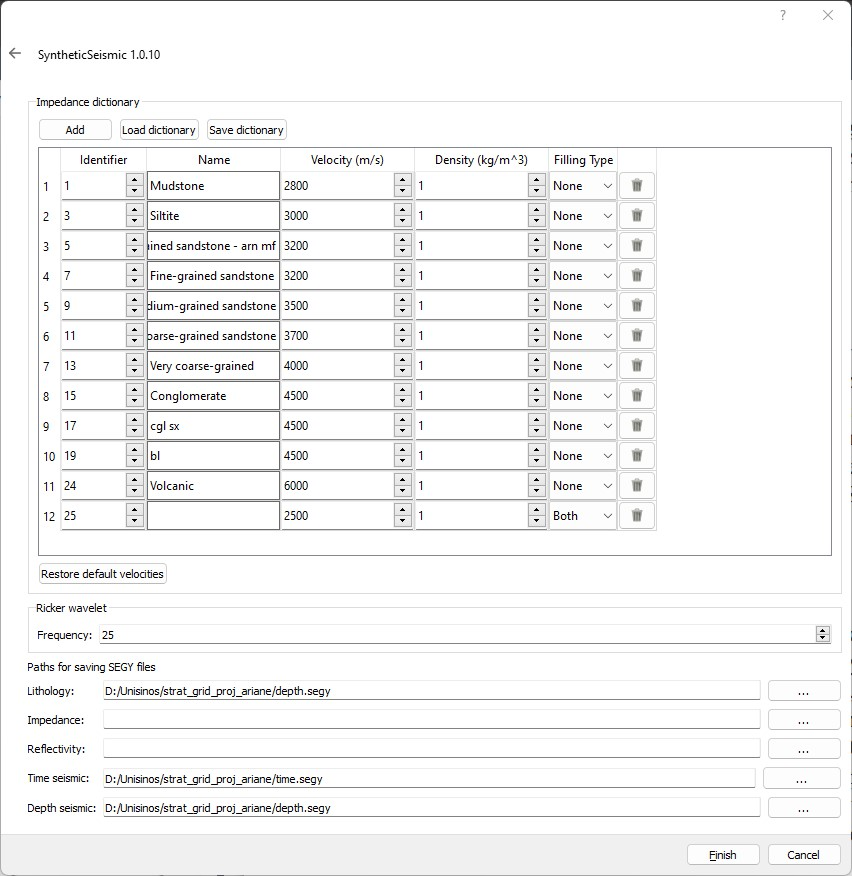

# SyntheticSeis
## Open Source synthetic seismic generator tool

Understanding how geological models are connected with seismic data can be a challenge, especially for new geologists.
There are many papers on how to generate synthetic seismics, but preparing data input, setup and executing these 
programs, usually scripts in Python and Matlab can be tedious. SyntheticSeis simplifies all these tasks with a simple 
graphic interface. The input data are Eclipse Grid files. Eclipse Grid is a popular format compatible with software like
Aspen SKUA and Petrel. The output data is the industry standard file, a SEG-Y file.

## 🚀 Getting Started

1. To get started, install the SyntheticSeis software at 
https://github.com/feliperails/syntheticseis/releases/tag/synthetic-seis-1.0.11.

2. Prepare your Eclipse Grid files that compound your geological model. These Eclipse Grid files should have a property
LITHOLOGYTYPE that identifies the lithology for each cell. You can visualize and check it using ResInsight available at
https://resinsight.org/, as we can see in the image below:
 

3. Open SyntheticSeis and select Eclipse Grid files in the first step:
 

4. Configure the number of cells of the SEG-Y file. You can choose any number of cells, but the recommendation is 
the number of cells for each axis should be greater than Eclipse Grid files to have a SEG-Y file that keeps the shape.
For example, if we have the number of cells below:
<table>
    <thead>
        <tr>
            <th rowspan="2">File</th>
            <th colspan="3">Number of cells</th>
        </tr>
        <tr>
            <th>X</th>
            <th>Y</th>
            <th>Z</th>
        </tr>
    </thead>
    <tbody>
        <tr>
            <td>strat_grid_molles40.grdecl</td>
            <td>225</td>
            <td>521</td>
            <td>49</td>
        </tr>
        <tr>
            <td>strat_grid_molles30.grdecl</td>
            <td>225</td>
            <td>521</td>
            <td>76</td>
        </tr>
        <tr>
            <td>strat_grid_molles20.grdecl</td>
            <td>225</td>
            <td>521</td>
            <td>59</td>
        </tr>
        <tr>
            <td>strat_grid_molles10.grdecl</td>
            <td>56</td>
            <td>130</td>
            <td>68</td>
        </tr>
        <tr>
            <td>Total</td>
            <td>731</td>
            <td>1693</td>
            <td>252</td>
        </tr>
        <tr>
            <td>SEG-Y dimensions</td>
            <td>287</td>
            <td>735</td>
            <td>1252</td>
        </tr>
    </tbody>
</table>
A good choice in this case is 287 x 735 x 1252, but why? Eclipse Grid files are compound of irregular hexahedrons and
SEG-Y files are compound of regular hexahedrons. So, we need to compensate the simple geometry of SEG-Y files with more
cells.

For this model, in the X-axis, the hexahedrons are almost regular, so we just increase the number of cells from
225 to 287. In the Y-axis the number of cells was decreased from 1693 (521 + 521 + 521 + 130) to 735 because there were
many lithologies in this axis with repeated lithologies. Finally, in the Z-axis we increased from 252 (49 + 76 + 59 + 68)
to 1252 because the cells were very irregular about this axis.

Anyway, there is no recipe to specify the number of cells because it depends of how hexahedrons are irregular in the 
Eclipse Grid files, but you can start with the sum of cells for each axis and if the result is not good, we can return 
to step 2 and adjust the number of cells.
A last warning, try to not use more than 500 x 500 x 500 for avoid a long time to process the model and excessive memory
usage.

 

5. The last step, you can configure the Wavelet frequency and where the SEG-Y should be saved. The recommend frequency
is 25Hz, because this value we usually use in real seismic data files. The paths to save lithology, impedance and
frequency are optional. These files can be used to correlate lithology data and seismic data only using SEG-Y files.
 

Finally, you can visualize the synthetic seismic data using your favorite Seismic visualizer as Aspen SKUA or Petrel. A
open-source and free option is OpendTect available at https://dgbes.com/software/opendtect, as we can see in the image
below:
 